<h1> 📑Herramientas Big Data</h1>
<div style="display: flex; align-items: center;">
    
    
</div>


Este es el [enlace](https://github.com/bkmay1417/Herramientas_Big_Data_Practica) al repositorio.
<p id="readme-top"></p>

 [HDFS](#1hdfs) | [HIVE](#2hive) | [Formatos de Almacenamiento](#3formatos-de-almacenamiento) | [SQL](#4SQL)   | [No-SQL](#5No-SQL) | [Spark](#6Spark) | [incremental con Spark](#7Carga-incremental-con-Spark)   

<p align="center">
    
</p>

<h2>📖 Introducción</h2>

Las herramientas Big Data son software diseñado para almacenar, procesar y analizar grandes volúmenes de datos de manera eficiente. Hadoop es un sistema de almacenamiento distribuido que permite procesar datos de forma paralela. Spark es un framework de procesamiento de datos en memoria que acelera el análisis de datos. Hive es una herramienta que facilita el análisis de datos estructurados mediante consultas estilo SQL sobre datos almacenados en Hadoop. Juntas, estas herramientas forman un ecosistema poderoso para gestionar y analizar grandes cantidades de información.

<p align="center"></p>

<h2>Pre-requisitos 📋</h2>

En este proyecto se llevó a cabo en un entorno de desarrollo Windows. Se utilizó una máquina virtual alojada en VirtualBox con Ubuntu Server, debido a que Docker no es compatible directamente con Windows. En la máquina virtual se instaló Docker para la gestión de contenedores. Para establecer la conexión entre la máquina virtual y el sistema operativo original de Windows, se empleó PuTTY. Además, para simplificar la transferencia y gestión de archivos en Ubuntu, también se puede optar por utilizar WinSCP.Los links se proveen a continuacion

Paso 0.01 Descarga el virtual disk de Ubuntu Server desde el siguiente enlace: [Descargar Ubuntu Server](https://drive.google.com/file/d/1EsDIcfz-MVvPwOSmUb-x5FE612puBZnF/view) (2.15 gb)

<p>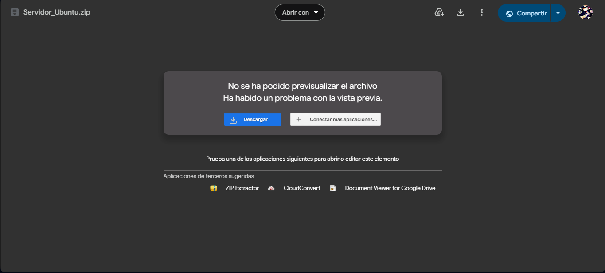</p>

Paso 0.02 Descarga e instala VirtualBox desde: [Descargar VirtualBox](https://www.virtualbox.org/wiki/Downloads)

<p>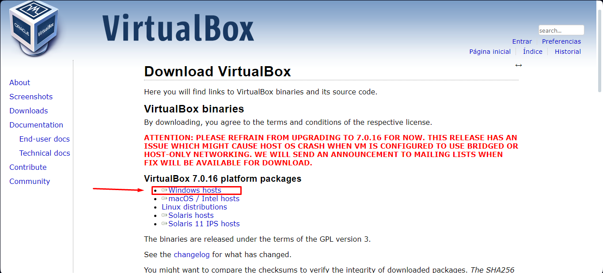</p>

Paso 0.03 Creamos una nueva maquina virtual

<p>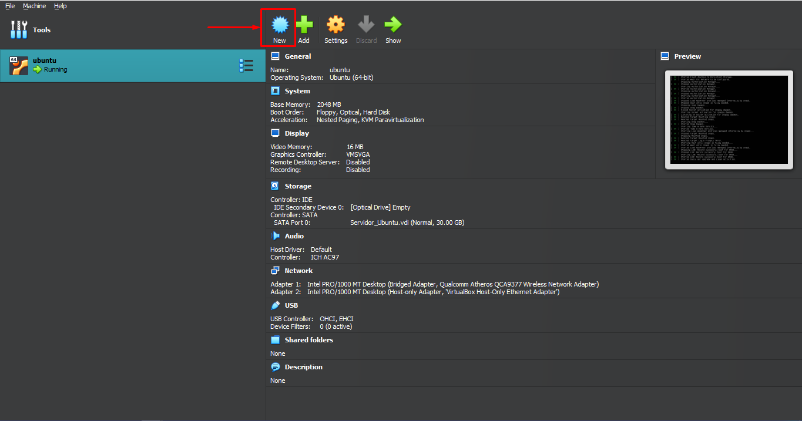</p>

Paso 0.04 La llamamos ubuntu

<p>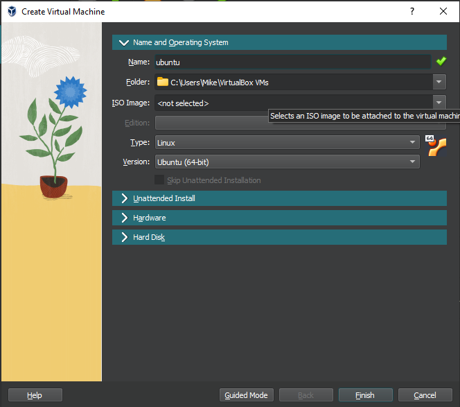</p>

Paso 0.05 Nos dirigimos a hard disk y ponemos utilizar un hard disk existente

<p>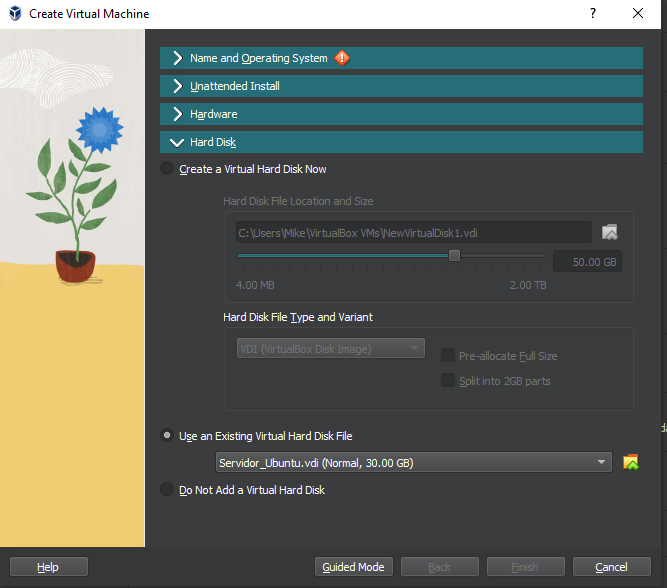</p>

Paso 0.06 Elegimos el hardisk anteriormente descargado y finalizar

<p>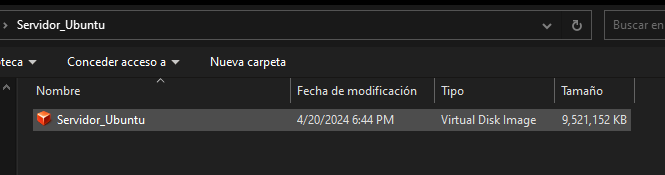</p>

Paso 0.07 Luego configuramos los puestos de red

<p>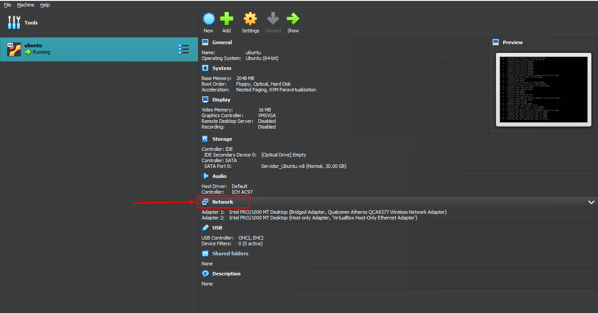</p>

Paso 0.08 En el primer adaptador pones adaptador puente y en avanzado permitir todo

<p></p>

Paso 0.09 En el segundo colocamos solo anfitrion y en avanzado permitir todo y guardamos 

<p>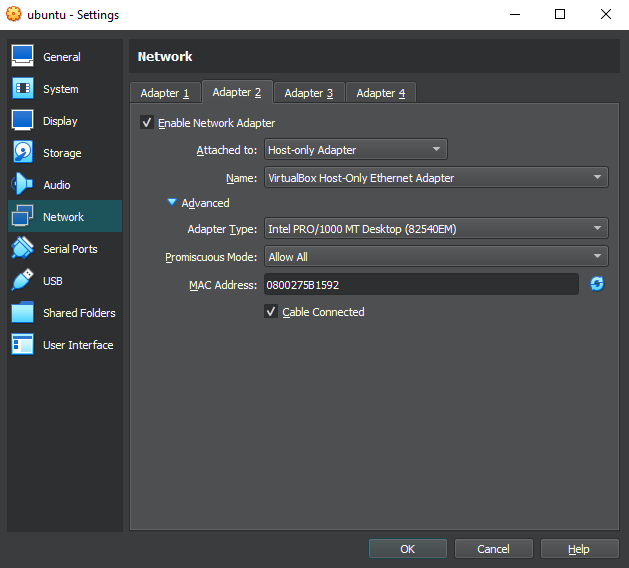</p>

Paso 0.10 Iniciamos la maquina virtual 

> [!CAUTION]
> Este paso fallara si se tiene la virtualizacion de windows desactivada .
> En este [video](https://www.youtube.com/watch?v=Tl4kODRGtIc&ab_channel=LuisOvalle)  explican como revisar si esta activa y en caso de no estarlo como activarlo 

<p>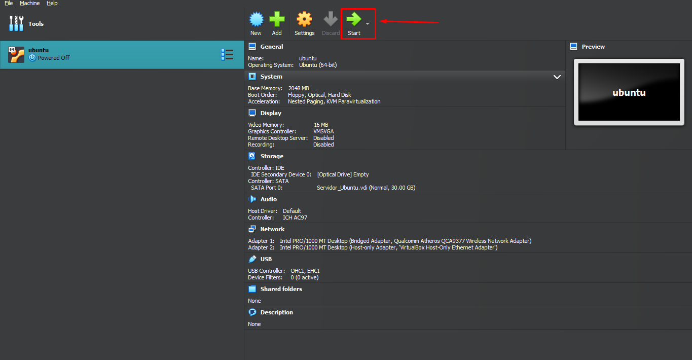</p>

Paso 0.11 esperamos un poco y ingresamos el usuario  y comtraseña  (por defecto viene ubuntu de usuario y ubuntu de contraseña)

<p>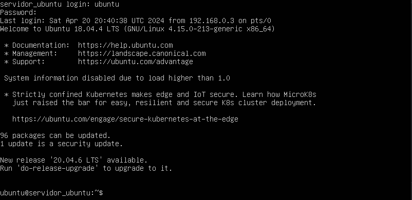</p>

Paso 0.12 A continuacion obtenemos el ip de la maquina virtual

```
hostname -I
```

<p>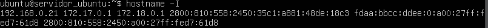</p>

Paso 0.13 Descargamos e instalamos el putty : [Descargar putty](https://www.putty.org/)

<p>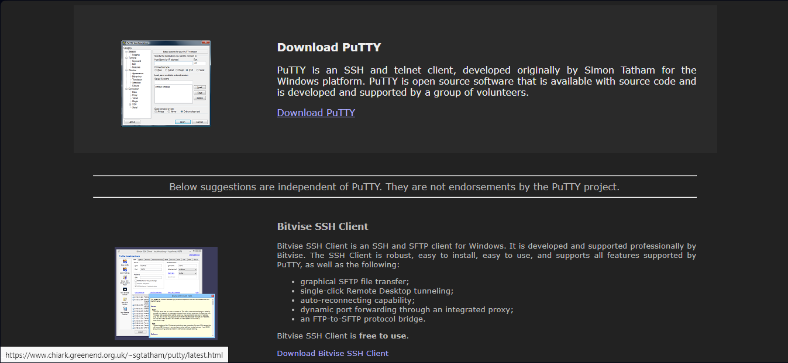</p>

Paso 0.14 Iniciamos el putty con la ip usuario y comtraseña de la maquina virtual

<p>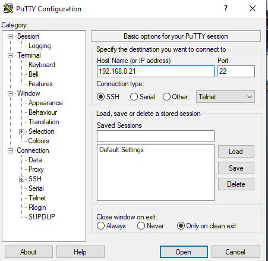</p>

Paso 0.15 Despues ingresamos el usuario y contraseña

<p>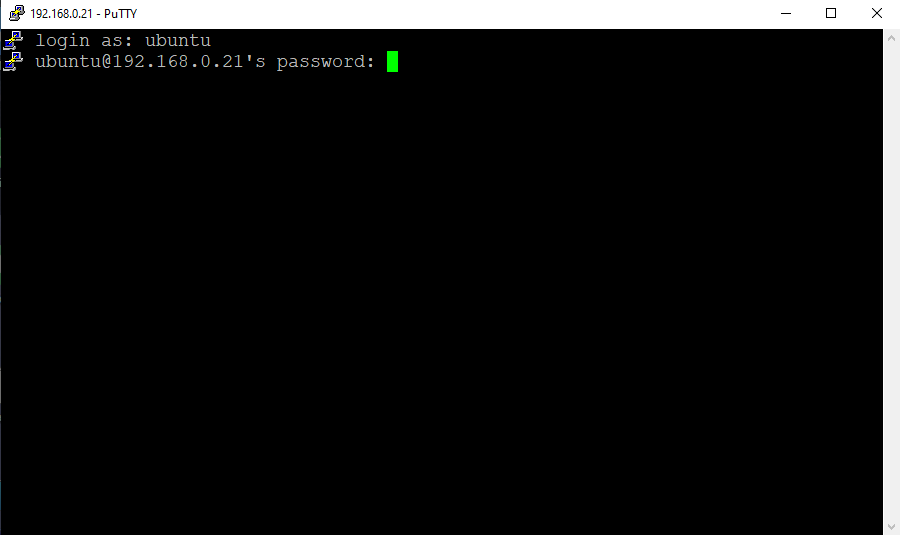</p>

Paso 0.16 Opcional descargar e instalar winscp : [Descargar winscp](https://winscp.net/eng/download.php)

<p>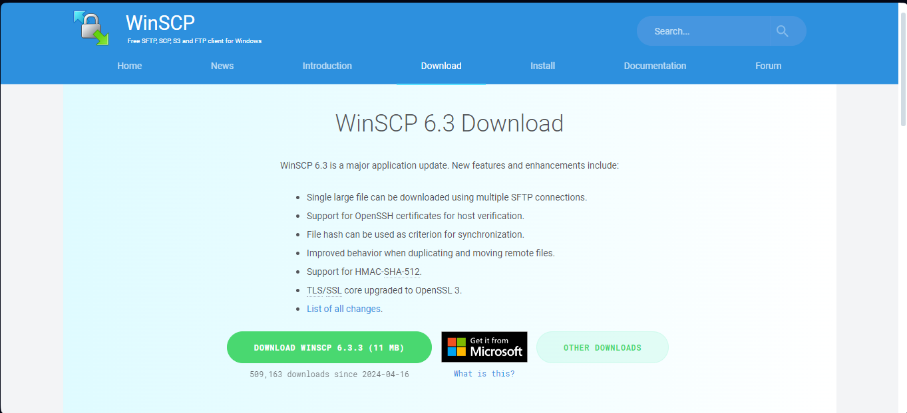</p>

Paso 0.17 Programa que nos permite editar y enviar archivos de una forma mas comoda se conecta igual que el putty con el ip de la maquina virtual

<p>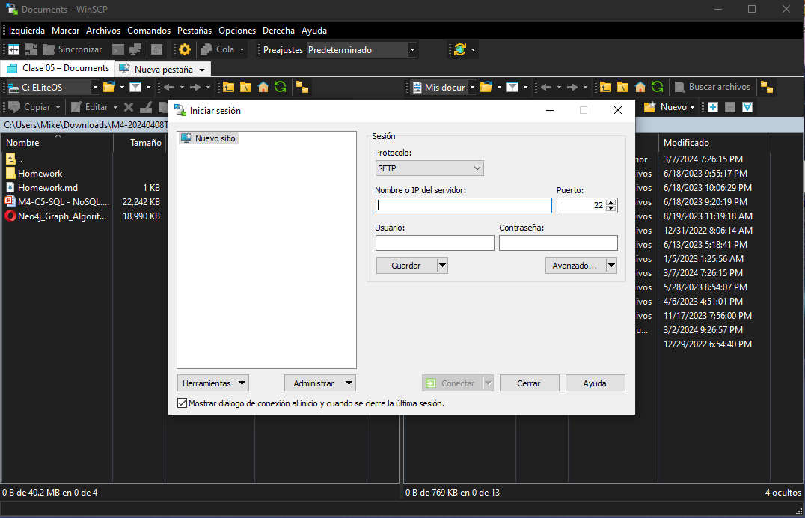</p>

<p align="right">(<a href="#readme-top">Volver al principio</a>)</p>

<h2> 🔗Practica Integradora </h2>

<p align="center"></p>

Durante esta practica la idea es emular un ambiente de trabajo, desde un área de innovación solicitan construir un MVP(Producto viable mínimo) de un ambiente de Big Data donde se deban cargar unos archivos CSV que anteriormente se utilizaban en un datawarehouse en MySQl, pero ahora en un entorno de Hadoop.
Desde la gerencia de Infraestructura no están muy convencidos de utilizar esta tecnología por lo que no se asigno presupuesto alguna para esta iniciativa, de forma tal que por el momento no es posible utilizar un Vendor(Azure, AWS, Google) para implementar dicho entorno, es por esto que todo el MVP se deberá implementar utilizando Docker de forma tal que se pueda hacer una demo al sector de infraestructura mostrando las ventajas de utilizar tecnologías de Big Data.

<h2> Entorno Docker con Hadoop, Spark y Hive </h2>

<p>Se presenta un entorno Docker con Hadoop (HDFS) y la implementación de:</p>
<ul>
    <li>Spark</li>
    <li>Hive</li>
    <li>HBase</li>
    <li>MongoDB</li>
    <li>Neo4J</li>
    <li>Zeppelin</li>
    <li>Kafka</li>
</ul>

Es importante mencionar que el entorno completo consume muchos recursos de su equipo, motivo por el cuál, se propondrán ejercicios pero con ambientes reducidos, en función de las herramientas utilizadas.
Ejecute docker network inspect en la red (por ejemplo, docker-hadoop-spark-hive_default) para encontrar la IP en la que se publican las interfaces de hadoop. Acceda a estas interfaces con las siguientes URL:
```
Namenode: http://<IP_Anfitrion>:9870/dfshealth.html#tab-overview
Datanode: http://<IP_Anfitrion>:9864/
Spark master: http://<IP_Anfitrion>:8080/
Spark worker: http://<IP_Anfitrion>:8081/	
HBase Master-Status: http://<IP_Anfitrion>:16010
HBase Zookeeper_Dump: http://<IP_Anfitrion>:16010/zk.jsp
HBase Region_Server: http://<IP_Anfitrion>:16030
Zeppelin: http://<IP_Anfitrion>:8888
Neo4j: http://<IP_Anfitrion>:7474
```
Paso 0.18 Para implementar ejecute las siguientes lineas:

```
git clone https://github.com/bkmay1417/Herramientas_Big_Data_Practica.git
```

<p>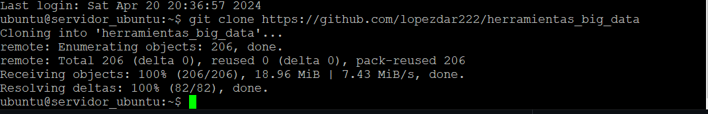</p>

Paso 0.19 Primero clonamos el repositorio que contiene lo nesesario para trabajar
```
cd Herramientas_Big_Data_Practica
```
Paso 0.20 ingresamos en el directorio 
```
sudo docker-compose -f docker-compose-v1.yml up -d
```

<p>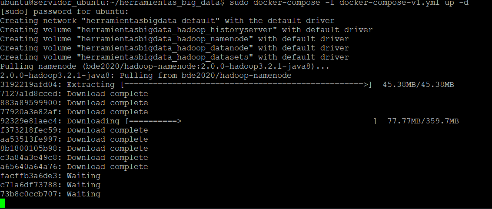</p>

> En este paso puede que te pidan la contraseña para su ejecucion 

> Levantaremos en el contenedor correspondiente

> [!NOTE]
> en el codigo sudo docker-compose -f docker-compose-v1.yml up -d el contenedor tendra que ser ejecutado la version corepodiente al punto que se espesifica en cada punto en caso de tener que usar otro el anterior tiene que ser detenido y el comando vuelto a ser ejecurtar con la version acorde 

<p align="right">(<a href="#readme-top">Volver al principio</a>)</p>

## 1)HDFS

<p align="center"></p>

>  Utilizar el entorno docker-compose-v1.yml

Paso 1.01 Copiar los archivos ubicados en la carpeta Datasets, dentro del contenedor "namenode"
```
sudo docker exec -it namenode bash
```
iniciarmos el contenedor
```
cd home
mkdir Datasets
```
nos moveremos a home y crearemos el directoio Datasets
```
cd Datasets 
mkdir cliente venta tipodegasto sucursal proveedor producto compra empleado canaldeventa gasto calendario data_nvo
exit
```
Nos debemos posicionar en "Datasets" y crearemos multiples carpetas y luego salimos

a continuacion utilizaremos un shell script llamado Paso00.sh que se encuentra en la carpeta herramientas_big_data clonada previamente

```
chmod u+x Paso00.sh
```
le damos premiso de ejecucion

```
./Paso00.sh
```
Ejecutamos

Luego hay que Ubicarse en el contenedor "namenode"
```
  sudo docker exec -it namenode bash
```
Crear un directorio en HDFS llamado "/data".
```
  hdfs dfs -mkdir -p /data
```
Copiar los archivos csv provistos a HDFS:
```
  hdfs dfs -put /home/Datasets/* /data
```
Despues salimos del contenedor
```
exit
```
Para verificar si se ejecuto correctamente podemos entrar al hdfs namenoda mediante
```
http://<IP_Anfitrion>:9870
```
Una vez adentro nos dirigimos a utilities/Browse the los archivos debe estar la carpeta data con los archivos
<p>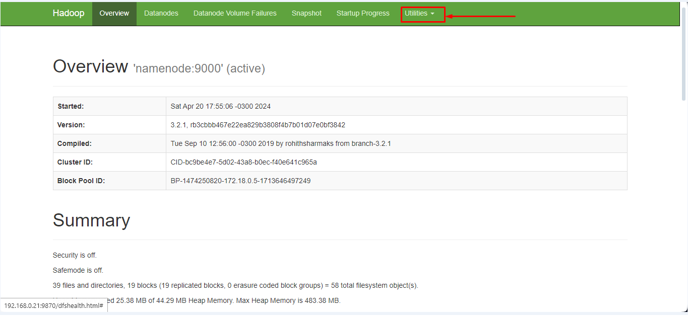</p>

En el browse los archivos debe estar la carpeta data con los archivos

<p>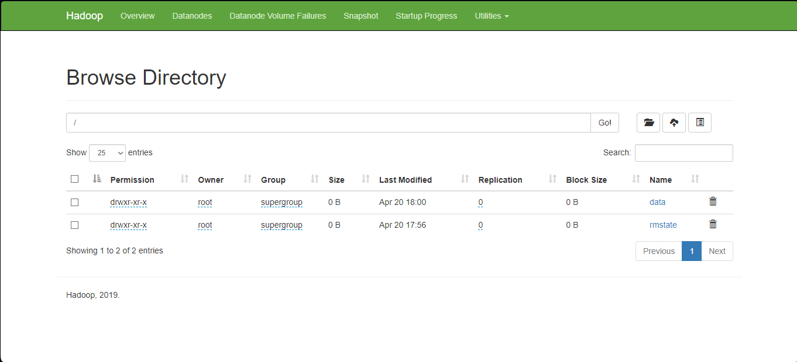</p>

Dentro de data deberia verse asi

<p>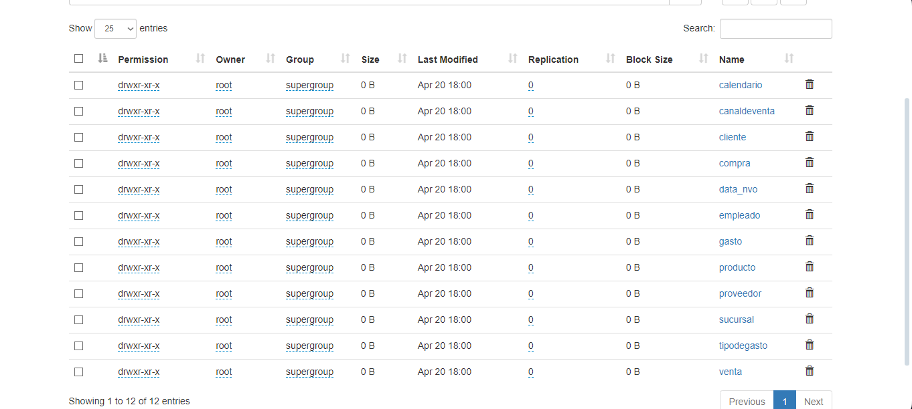</p>

> [!IMPORTANT]
>  Busque dfs.blocksize y dfs.replication en  para encontrar los valores de tamaño de bloque y factor de réplica respectivamente entre otras configuraciones del sistema Hadoop.

```
http://<IP_Anfitrion>:9870/conf
```
> [!TIP]
> Recomiendo buscarlo con ctrl + f en el navegar 

<p>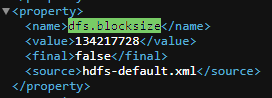</p>

<p>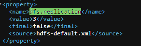</p>

<p align="right">(<a href="#readme-top">Volver al principio</a>)</p>

## 2)Hive
<p align="center"></p>
Para este paso se debe utilizar el entorno docker-compose-v2.yml

> [!NOTE]
> En caso de te tener iniciado el entorno docker-compose-v1.yml ejecutar 
```
sudo docker stop $(sudo docker ps -a -q)
```


<p>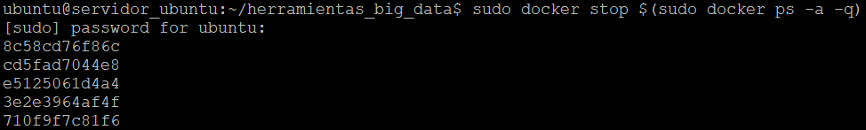</p>

inciamos el entorno docker-compose-v2.yml
```
sudo docker-compose -f docker-compose-v2.yml up -d
```

Procederemos a crear tablas en Hive, a partir de los csv en HDFS.
Realizaremos este procedimiento utilizando el paso02.hql
```
sudo docker cp ./Paso02.hql hive-server:/opt/
```
De esta forma enviamos eln paso02 al server de hive

Ahora iniciaremos en server
```
sudo docker exec -it hive-server bash
```
Ejecutamos el hql
```
hive -f Paso02.hql
```
podemos vericar ingresando a hive 
```
hive
```
ejempllo de como revisar 
```
use integrador;
show tables;
select * from cliente limit 5;
exit; 
```

<p>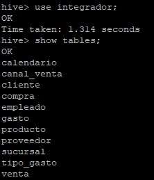</p>

<p>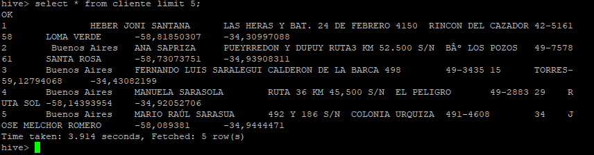</p>

si todo funciona correctamente salimos 
```
exit
```

<p align="right">(<a href="#readme-top">Volver al principio</a>)</p>

## 3)Formatos de Almacenamiento
<p align="center"></p>
Para este paso se sigue utilizando el entorno docker-compose-v2.yml

Las tablas creadas en el punto 2 a partir de archivos en formato csv, deben ser almacenadas en formato Parquet + Snappy. Tener en cuenta además de aplicar particiones para alguna de las tablas.

utilizaremos el paso03.hql para la creacion de una nueva basedatos, comprecion y particion de la tabla gasto 
```
sudo docker cp ./Paso03.hql hive-server:/opt/
```
De esta forma enviamos el paso03 al server de hive

Ahora iniciaremos en server
```
sudo docker exec -it hive-server bash
```
Ejecutamos el hql
```
hive -f Paso03.hql
```

podemos vericar ingresando a hive 
```
hive
```
```
use integrador2;
show tables;
select * from cliente limit 5;
select COUNT(*) from cliente;
select * from gasto limit 5;
exit; 
```

<p>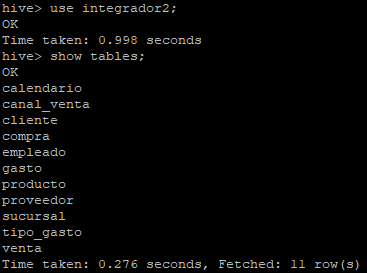</p>

<p>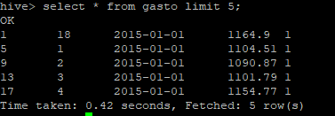</p>

<p>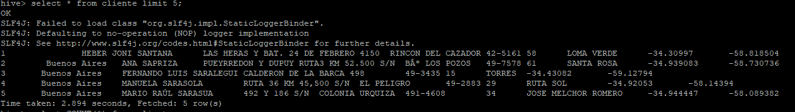</p>

```
exit
```
<p align="right">(<a href="#readme-top">Volver al principio</a>)</p>

## 4)SQL
<p align="center"></p>

 <p>   La mejora en la velocidad de consulta que puede proporcionar un índice tiene el costo del procesamiento adicional para crear el índice y el espacio en disco para almacenar las referencias del índice. Se recomienda que los índices se basen en las columnas que utiliza en las condiciones de filtrado. El índice en la tabla puede degradar su rendimiento en caso de que no los esté utilizando. Crear índices en alguna de las tablas cargadas y probar los resultados:</p>


```
CREATE INDEX index_name
 ON TABLE base_table_name (col_name, ...)
 AS index_type
 [WITH DEFERRED REBUILD]
 [IDXPROPERTIES (property_name=property_value, ...)]
 [IN TABLE index_table_name]
 [ [ ROW FORMAT ...] STORED AS ...
 | STORED BY ... ]
 [LOCATION hdfs_path]
 [TBLPROPERTIES (...)]
 [COMMENT "index comment"];
```

Ejemplo:

```
hive> CREATE INDEX index_students ON TABLE students(id) 
 > AS 'org.apache.hadoop.hive.ql.index.compact.CompactIndexHandler' 
 > WITH DEFERRED REBUILD ;
```

ALTER INDEX index_name ON table_name [PARTITION partition_spec] REBUILD;

Ejemplo:
```
hive> ALTER INDEX index_students ON students REBUILD; 
```

DROP INDEX [IF EXISTS] index_name ON table_name;
```
hive> DROP INDEX IF EXISTS index_students ON students; 
```
<h4 align="center">
:construction: En construcion  :construction:
</h4>


 

### 🛠️ ¡Preparándose para el lanzamiento! Tema en desarrollo y prueba 🛠️

### 💡 Proyecto en etapa de desarrollo y prueba 💡

> [!WARNING]
>⚠️  Apartir de este punto se puede presentar errores aum está en fase de desarrollo y prueba⚠️

<p align="right">(<a href="#readme-top">Volver al principio</a>)</p>

## 5)No-SQL

<details><summary>No-SQL</summary><ul><li>[HBase](#1HBase)</li><li>[MongoDB](#2MongoDB)</li><li>[Neo4J](#3Neo4J)</li></ul></details> 

<p align="center"></p>

> Se puede utilizar el entorno docker-compose-v3.yml

> [!NOTE]
> En caso de te tener iniciado el entorno docker-compose-v2.yml ejecutar 
```
sudo docker stop $(sudo docker ps -a -q)
```
inciamos el entorno docker-compose-v3.yml
```
sudo docker-compose -f docker-compose-v3.yml up -d
```


#### 1)HBase:
<p align="center">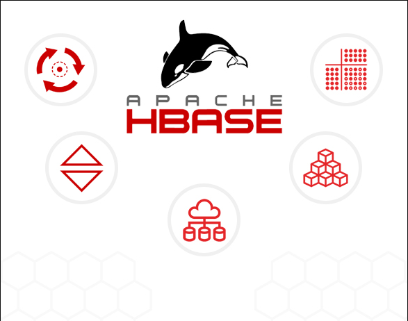</p>

Instrucciones:
1-
-Iniciamos el shell

	sudo docker exec -it hbase-master hbase shell

creamos la tabla

	create 'personal','personal_data'

revisamos la creacion

	list 'personal'

poblamos las tablas
```
put 'personal',1,'personal_data:name','Juan'
put 'personal',1,'personal_data:city','Córdoba'
put 'personal',1,'personal_data:age','25'
put 'personal',2,'personal_data:name','Franco'
put 'personal',2,'personal_data:city','Lima'
put 'personal',2,'personal_data:age','32'
put 'personal',3,'personal_data:name','Ivan'
put 'personal',3,'personal_data:age','34'
put 'personal',4,'personal_data:name','Eliecer'
put 'personal',4,'personal_data:city','Caracas'
get 'personal','4'
```
> [!CAUTION]
> cuidado con los simbolos especiales debido a la codificacion.
procemos a verificar la carga

	get 'personal','4'
 si esta todo correcto salimos

 	exit

-En el namenode del cluster copiamos el archivo personal.csv en la carpeta /data de HDFS:

	hdfs dfs -put personal.csv /hbase/data/personal.csv
procedemos a salir
```
 exit
```
iniciamos el hbase

	sudo docker exec -it hbase-master bash
 cargamos las tablas
		
    hbase org.apache.hadoop.hbase.mapreduce.ImportTsv -Dimporttsv.separator=',' -Dimporttsv.columns=HBASE_ROW_KEY,personal_data:name,personal_data:city,personal_data:age personal hdfs://namenode:9000/hbase/data/personal.csv

ingresamos al shell

	hbase shell

revisamos que se hayan cargado los datos correctamente

	scan 'personal'

cargamos los datos

		scan 'personal'
		create 'album','label','image'
		put 'album','label1','label:size','10'
		put 'album','label1','label:color','255:255:255'
		put 'album','label1','label:text','Family album'
		put 'album','label1','image:name','holiday'
		put 'album','label1','image:source','/tmp/pic1.jpg'
		get 'album','label1'

 verificamos

	get 'album','label1'

#### 2)MongoDB
<p align="center"></p>

Instrucciones:

copiamos el iris.csv  al contenedor de mongo

	sudo docker cp iris.csv mongodb:/data/iris.csv

copiamos iris.json al contenedor de mongo

    sudo docker cp iris.json mongodb:/data/iris.json

ingresamos al mongo

	sudo docker exec -it mongodb bash
Importamos los archivos

	mongoimport /data/iris.csv --type csv --headerline -d dataprueba -c iris_csv

	mongoimport --db dataprueba --collection iris_json --file /data/iris.json --jsonArray
entramos a mongosh

	mongosh
> [!TIP]
> utilizar .pretty() para visualizar mejor
 ```
use dataprueba
show collections
db.iris_csv.find()
db.iris_json.find()
exit
```
exportamos los archivos

	mongoexport --db dataprueba --collection iris_csv --fields sepal_length,sepal_width,petal_length,petal_width,species --type=csv --out /data/iris_export.csv

	mongoexport --db dataprueba --collection iris_json --fields sepal_length,sepal_width,petal_length,petal_width,species --type=json --out /data/iris_export.json
	exit
> [!IMPORTANT]
>Descargar desde https://search.maven.org/search?q=g:org.mongodb.mongo-hadoop los jar:
>https://search.maven.org/search?q=a:mongo-hadoop-hive
>https://search.maven.org/search?q=a:mongo-hadoop-spark

copiamos los archivos dentro de la carpeta Mongo en lib de hive
```
sudo docker cp mongo-hadoop-hive-2.0.2.jar hive-server:/opt/hive/lib/mongo-hadoop-hive-2.0.2.jar
sudo docker cp mongo-hadoop-core-2.0.2.jar hive-server:/opt/hive/lib/mongo-hadoop-core-2.0.2.jar
sudo docker cp mongo-hadoop-spark-2.0.2.jar hive-server:/opt/hive/lib/mongo-hadoop-spark-2.0.2.jar
sudo docker cp mongo-java-driver-3.12.11.jar hive-server:/opt/hive/lib/mongo-java-driver-3.12.11.jar
```

7)
 
		sudo docker cp iris.hql hive-server:/opt/iris.hql
	
 		sudo docker exec -it hive-server bash

8)

    		hiveserver2
		chmod 777 iris.hql
		hive -f iris.hql

	
### 3)Neo4J
<p align="center"></p>
	
	Ejemplo de búsqueda del camino más corto:
		https://neo4j.com/docs/graph-data-science/current/algorithms/dijkstra-source-target/

```	
		CREATE (a:Location {name: 'A'}),
			   (b:Location {name: 'B'}),
			   (c:Location {name: 'C'}),
			   (d:Location {name: 'D'}),
			   (e:Location {name: 'E'}),
			   (f:Location {name: 'F'}),
			   (a)-[:ROAD {cost: 50}]->(b),
			   (b)-[:ROAD {cost: 50}]->(a),
			   (a)-[:ROAD {cost: 50}]->(c),
			   (c)-[:ROAD {cost: 50}]->(a),
			   (a)-[:ROAD {cost: 100}]->(d),
			   (d)-[:ROAD {cost: 100}]->(a),
			   (b)-[:ROAD {cost: 40}]->(d),
			   (d)-[:ROAD {cost: 40}]->(b),
			   (c)-[:ROAD {cost: 40}]->(d),
			   (d)-[:ROAD {cost: 40}]->(c),
			   (c)-[:ROAD {cost: 80}]->(e),
			   (e)-[:ROAD {cost: 80}]->(c),
			   (d)-[:ROAD {cost: 30}]->(e),
			   (e)-[:ROAD {cost: 30}]->(d),
			   (d)-[:ROAD {cost: 80}]->(f),
			   (f)-[:ROAD {cost: 80}]->(d),
			   (e)-[:ROAD {cost: 40}]->(f),
			   (f)-[:ROAD {cost: 40}]->(e);
			   
		CALL gds.graph.project(
			'miGrafo',
			'Location',
			'ROAD',
			{
				relationshipProperties: 'cost'
			}
		)

		MATCH (l:Location) RETURN l
					
		MATCH (source:Location {name: 'A'}), (target:Location {name: 'E'})
		CALL gds.shortestPath.dijkstra.write.estimate('miGrafo', {
			sourceNode: source,
			targetNode: target,
			relationshipWeightProperty: 'cost',
			writeRelationshipType: 'PATH'
		})
		YIELD nodeCount, relationshipCount, bytesMin, bytesMax, requiredMemory
		RETURN nodeCount, relationshipCount, bytesMin, bytesMax, requiredMemory

		MATCH (source:Location {name: 'A'}), (target:Location {name: 'E'})
		CALL gds.shortestPath.dijkstra.stream('miGrafo', {
			sourceNode: source,
			targetNode: target,
			relationshipWeightProperty: 'cost'
		})
		YIELD index, sourceNode, targetNode, totalCost, nodeIds, costs, path
		RETURN
			index,
			gds.util.asNode(sourceNode).name AS sourceNodeName,
			gds.util.asNode(targetNode).name AS targetNodeName,
			totalCost,
			[nodeId IN nodeIds | gds.util.asNode(nodeId).name] AS nodeNames,
			costs,
			nodes(path) as path
		ORDER BY index
```	

  Ejemplo de logística:
    https://neo4j.com/docs/graph-data-science/current/alpha-algorithms/minimum-weight-spanning-tree/

```	
		MATCH (n:Location {name: 'A'})
		CALL gds.alpha.spanningTree.minimum.write('miGrafo', {
		  startNodeId: id(n),
		  relationshipWeightProperty: 'cost',
		  writeProperty: 'MINST',
		  weightWriteProperty: 'writeCost'
		})
		YIELD preProcessingMillis, computeMillis, writeMillis, effectiveNodeCount
		RETURN preProcessingMillis, computeMillis, writeMillis, effectiveNodeCount;		

		MATCH path = (n:Location {name: 'A'})-[:MINST*]-()
		WITH relationships(path) AS rels
		UNWIND rels AS rel
		WITH DISTINCT rel AS rel
		RETURN startNode(rel).name AS source, endNode(rel).name AS destination, rel.writeCost AS cost
		
		MATCH (n) DETACH DELETE n

		sudo docker cp producto.csv neo4j:/var/lib/neo4j/import/producto.csv
		sudo docker cp tipo_producto.csv neo4j:/var/lib/neo4j/import/tipo_producto.csv
		sudo docker cp cliente.csv neo4j:/var/lib/neo4j/import/cliente.csv
		sudo docker cp venta.csv neo4j:/var/lib/neo4j/import/venta.csv
		
		Ver Archivo "ejemploNeo4J.txt"		
```	

#### 4) Zeppelin

<p align="center"></p>

		HDFS:
		En la máquina anfitrión probar WebHDFS:
			curl "http://<IP_Anfitrion>:9870/webhdfs/v1/?op=LISTSTATUS"
		En el interpreter:
			En la parte de "file"
				Variable hdfs.url = http://<IP_Anfitrion>:9870/webhdfs/v1/
		En nuevo notebook / nueva nota:
			%file
			ls /

		Neo4J:
		En el interpreter
			En la parte de "neo4J"
				Variables 
					neo4J.url = http://<IP_Anfitrion>:7687
					neo4j.auth.user	= neo4j
					neo4j.auth.password	= zeppelin
     
<p align="right">(<a href="#readme-top">Volver al principio</a>)</p>

## 6)Spark

<p align="center"></p>

> [!CAUTION]
> En caso de te tener iniciado el entorno docker-compose-v3.yml ejecutar 

	sudo docker stop $(sudo docker ps -a -q)

> [!NOTE]
> Se debe utilizar los entornos docker-compose-v4.yml y docker-compose-kafka.yml

	sudo docker-compose -f docker-compose-v4.yml up -d
 
 	sudo docker-compose -f docker-compose-kafka.yml up -d

### 1) Spark y Scala:

<p align="center"></p>

Ubicarse en la línea de comandos del Spark master y comenzar PySpark.
```
  docker exec -it spark-master bash
  /spark/bin/pyspark --master spark://spark-master:7077
```

Cargar raw-flight-data.csv desde HDFS.
```
	from pyspark.sql.types import *

	flightSchema = StructType([
	StructField("DayofMonth", IntegerType(), False),
	StructField("DayOfWeek", IntegerType(), False),
	StructField("Carrier", StringType(), False),
	StructField("OriginAirportID", IntegerType(), False),
	StructField("DestAirportID", IntegerType(), False),
	StructField("DepDelay", IntegerType(), False),
	StructField("ArrDelay", IntegerType(), False),
	]);

	flights = spark.read.csv('hdfs://namenode:9000/data/flights/raw-flight-data.csv', schema=flightSchema, header=True)
  
  	flights.show()

	  +----------+---------+-------+---------------+-------------+--------+--------+
|DayofMonth|DayOfWeek|Carrier|OriginAirportID|DestAirportID|DepDelay|ArrDelay|
+----------+---------+-------+---------------+-------------+--------+--------+
|        19|        5|     DL|          11433|        13303|      -3|       1|
|        19|        5|     DL|          14869|        12478|       0|      -8|
|        19|        5|     DL|          14057|        14869|      -4|     -15|
|        19|        5|     DL|          15016|        11433|      28|      24|
|        19|        5|     DL|          11193|        12892|      -6|     -11|
|        19|        5|     DL|          10397|        15016|      -1|     -19|
|        19|        5|     DL|          15016|        10397|       0|      -1|
|        19|        5|     DL|          10397|        14869|      15|      24|
|        19|        5|     DL|          10397|        10423|      33|      34|
|        19|        5|     DL|          11278|        10397|     323|     322|
|        19|        5|     DL|          14107|        13487|      -7|     -13|
|        19|        5|     DL|          11433|        11298|      22|      41|
|        19|        5|     DL|          11298|        11433|      40|      20|
|        19|        5|     DL|          11433|        12892|      -2|      -7|
|        19|        5|     DL|          10397|        12451|      71|      75|
|        19|        5|     DL|          12451|        10397|      75|      57|
|        19|        5|     DL|          12953|        10397|      -1|      10|
|        19|        5|     DL|          11433|        12953|      -3|     -10|
|        19|        5|     DL|          10397|        14771|      31|      38|
|        19|        5|     DL|          13204|        10397|       8|      25|
+----------+---------+-------+---------------+-------------+--------+--------+
only showing top 20 rows
  	flights.describe()
```

Ubicarse en la línea de comandos del Spark master y comenzar Scala.
```
  docker exec -it spark-master bash
  spark/bin/spark-shell --master spark://spark-master:7077
```

Cargar raw-flight-data.csv desde HDFS.
```
	case class flightSchema(DayofMonth:String, DayOfWeek:String, Carrier:String, OriginAirportID:String, DestAirportID:String, DepDelay:String, ArrDelay:String)
	val flights = spark.read.format("csv").option("sep", ",").option("header", "true").load("hdfs://namenode:9000/data/flights/raw-flight-data.csv").as[flightSchema]

  	flights.show()
	
+----------+---------+-------+---------------+-------------+--------+--------+
|DayofMonth|DayOfWeek|Carrier|OriginAirportID|DestAirportID|DepDelay|ArrDelay|
+----------+---------+-------+---------------+-------------+--------+--------+
|        19|        5|     DL|          11433|        13303|      -3|       1|
|        19|        5|     DL|          14869|        12478|       0|      -8|
|        19|        5|     DL|          14057|        14869|      -4|     -15|
|        19|        5|     DL|          15016|        11433|      28|      24|
|        19|        5|     DL|          11193|        12892|      -6|     -11|
|        19|        5|     DL|          10397|        15016|      -1|     -19|
|        19|        5|     DL|          15016|        10397|       0|      -1|
|        19|        5|     DL|          10397|        14869|      15|      24|
|        19|        5|     DL|          10397|        10423|      33|      34|
|        19|        5|     DL|          11278|        10397|     323|     322|
|        19|        5|     DL|          14107|        13487|      -7|     -13|
|        19|        5|     DL|          11433|        11298|      22|      41|
|        19|        5|     DL|          11298|        11433|      40|      20|
|        19|        5|     DL|          11433|        12892|      -2|      -7|
|        19|        5|     DL|          10397|        12451|      71|      75|
|        19|        5|     DL|          12451|        10397|      75|      57|
|        19|        5|     DL|          12953|        10397|      -1|      10|
|        19|        5|     DL|          11433|        12953|      -3|     -10|
|        19|        5|     DL|          10397|        14771|      31|      38|
|        19|        5|     DL|          13204|        10397|       8|      25|
+----------+---------+-------+---------------+-------------+--------+--------+
only showing top 20 rows
```

#### 2) Kafka	

<p align="center"></p>

```		
			sudo docker-compose up -d
			sudo docker exec -it kafka_container bash
			cd /opt/kafka/bin
			sh kafka-topics.sh --create --bootstrap-server kafka:9092 --replication-factor 1 --partitions 100 --topic demo
			sh kafka-topics.sh --list --bootstrap-server kafka:9092
			sh kafka-topics.sh --describe --bootstrap-server kafka:9092 --topic demo 
			sh kafka-console-consumer.sh --bootstrap-server kafka:9092 --topic demo --from-beginning
			sh kafka-console-producer.sh --broker-list localhost:9092 --topic demo
				Escribir desde la consola del productor "Esto es una Prueba 1" y enviar.
				
			Acceder a <IP_Anfitrion>:9000	
	
			Desde Scala:
			val df = spark.readStream
					.format("kafka")
					.option("kafka.bootstrap.servers", "192.168.1.100:9092")
					.option("subscribe", "json_topic")
					.option("startingOffsets", "earliest") // From starting
					.load()

			df.printSchema()
			
			Más ejemplos:
				https://github.com/dbusteed/kafka-spark-streaming-example
						
			Otra forma de ejecutar:
			docker-compose exec kafka kafka-console-consumer.sh --bootstrap-server kafka:9092 --topic TenMinPsgCnts --from-beginning
```	

#### 3) Comparativa Dataset y Dataframe en Scala:

<p align="center">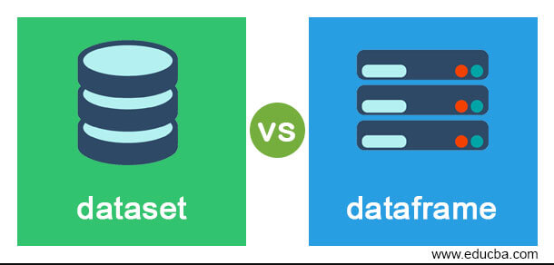</p>

```	
    sudo docker cp pruebaPySpark.py spark-master:pruebaPySpark.py
    sudo docker cp pruebaScala.scala spark-master:pruebaScala.scala

		sudo docker exec -it spark-master bash
		
		/spark/bin/spark-submit --master spark://spark-master:7077 pruebaPySpark.py
		/spark/bin/spark-shell --master spark://spark-master:7077 -i pruebaScala.scala
		
		/spark/bin/pyspark --master spark://spark-master:7077
		/spark/bin/spark-shell --master spark://spark-master:7077
```	

#### 4) ETL con Spark

<p align="center"></p>

A partir de la tabla venta generada en Parqet, realizar el proceso de filtrado de valores outliers utilizando Spark.

<p align="right">(<a href="#readme-top">Volver al principio</a>)</p>

## 7)Carga incremental con Spark 

Ahora resta evaluar qué sucede cuando en los sistemas fuente, se genere más dato, es decir, siguiendo los datos de esta práctica, qué pasa cuando se carguen más ventas. Se debería tomar las novedades e ingestar en el modelo existente cada día, de modo que la tabla venta, irá creciendo en cantidad de registro de manera diaria.
Para este fin, se provee un script en spark que realiza la generación de nuevas ventas, de manera aleatoria, para poder crear una situación, donde se cuenta con novedades para la tabla de venta. El script "Paso06_GeneracionVentasNuevasPorDia.py" utiliza los datasets provistos en la carpeta "Datasets\data_nvo" para generar las novedades de forma automática. Revisar la variable "fecha_nvo" que contiene la fecha para la que se quiere generar información, como tenemos datos hasta el año 2020, la fecha de ejemplo tomada es '2021-01-01'.
Es necesiario entonces generar, un script tal que tome las novedades en csv, y las cargue al modelo.

```	
	sudo docker exec -it spark-master /spark/bin/spark-submit --master spark://spark-master:7077 /home/Paso06_GeneracionVentasNuevasPorDia.py
```	
Supongamos que tenemos nuestro script, y ahora se quiere programar su ejecución:
```	
	/spark/bin/spark-submit --master spark://spark-master:7077 Paso06_IncrementalVentas.py
```	

Con crontab, para que ejecute cada día a las 5 AM:
```
	$ crontab -e
	5	0	*	*	*	/home/CargaIncremental.sh

	$ crontab -l
```	
<p align="right">(<a href="#readme-top">Volver al principio</a>)</p>

## 8) Herramientas de orquestación de flujos de datos

https://github.com/sercasti/datalaketools

# Referencias

* https://github.com/soyHenry/DS-M4-Herramientas_Big_Data


## Desarrolladores

| [<br><sub>Michael Martinez</sub>](https://github.com/bkmay1417) |
| :---: |

Copyright (c) 2024 [Michael Martinez] yam8991@gmail.com


