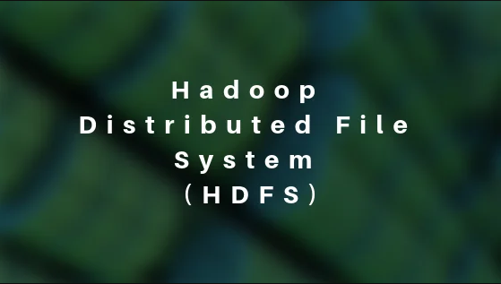

<h1> 📑Herramientas Big Data</h1>

 [HDFS](#1hdfs) | [HIVE](#2hive) | [Formatos de Almacenamiento](#3formatos-de-almacenamiento) | [SQL](#4SQL)

<p align="center">
    
</p>

<h2>Introducción</h2>

Las herramientas Big Data son software diseñado para almacenar, procesar y analizar grandes volúmenes de datos de manera eficiente. Hadoop es un sistema de almacenamiento distribuido que permite procesar datos de forma paralela. Spark es un framework de procesamiento de datos en memoria que acelera el análisis de datos. Hive es una herramienta que facilita el análisis de datos estructurados mediante consultas estilo SQL sobre datos almacenados en Hadoop. Juntas, estas herramientas forman un ecosistema poderoso para gestionar y analizar grandes cantidades de información.

<p align="center"></p>

<h2>Pre-requisitos</h2>

En este proyecto se llevó a cabo en un entorno de desarrollo Windows. Se utilizó una máquina virtual alojada en VirtualBox con Ubuntu Server, debido a que Docker no es compatible directamente con Windows. En la máquina virtual se instaló Docker para la gestión de contenedores. Para establecer la conexión entre la máquina virtual y el sistema operativo original de Windows, se empleó PuTTY. Además, para simplificar la transferencia y gestión de archivos en Ubuntu, también se puede optar por utilizar WinSCP.Los links se proveen a continuacion

Paso 0.01 Descargarmos y descomprimimos el virtual disk de ubuntu server (2.15 gb)
```
https://drive.google.com/file/d/1EsDIcfz-MVvPwOSmUb-x5FE612puBZnF/view
```
<p></p>

Paso 0.02 Descagamos el virtual box e instalamos
```
https://www.virtualbox.org/wiki/Downloads
```
<p></p>

Paso 0.03 Creamos una nueva maquina virtual

<p></p>

Paso 0.04 La llamamos ubuntu

<p></p>

Paso 0.05 Nos dirigimos a hard disk y ponemos utilizar un hard disk existente

<p></p>

Paso 0.06 Elegimos el hardisk anteriormente descargado y finalizar

<p></p>

Paso 0.07 Luego configuramos los puestos de red

<p></p>

Paso 0.08 En el primer adaptador pones adaptador puente y en avanzado permitir todo

<p></p>

Paso 0.09 En el segundo colocamos solo anfitrion y en avanzado permitir todo y guardamos 

<p></p>

Paso 0.10 Iniciamos la maquina virtual 

<p></p>

Paso 0.11 esperamos un poco y ingresamos el usuario  y comtraseña  (por defecto viene ubuntu de usuario y ubuntu de contraseña)

<p></p>

Paso 0.12 A continuacion obtenemos el ip de la maquina virtual

```
hostname -I
```

<p></p>

Paso 0.13 Descargamos e instalamos el putty
```
https://www.putty.org/
```

<p></p>

Paso 0.14 Iniciamos el putty con la ip usuario y comtraseña de la maquina virtual

<p></p>

Paso 0.15 Despues ingresamos el usuario y contraseña

<p></p>

Paso 0.16 Opcional descargar e instalar winscp 
```
https://winscp.net/eng/download.php
```

<p></p>

Paso 0.17 Programa que nos permite editar y enviar archivos de una forma mas comoda se conecta igual que el putty con el ip de la maquina virtual

<p></p>


<h2> Practica Integradora </h2>

<p align="center"></p>

Durante esta practica la idea es emular un ambiente de trabajo, desde un área de innovación solicitan construir un MVP(Producto viable mínimo) de un ambiente de Big Data donde se deban cargar unos archivos CSV que anteriormente se utilizaban en un datawarehouse en MySQl, pero ahora en un entorno de Hadoop.
Desde la gerencia de Infraestructura no están muy convencidos de utilizar esta tecnología por lo que no se asigno presupuesto alguna para esta iniciativa, de forma tal que por el momento no es posible utilizar un Vendor(Azure, AWS, Google) para implementar dicho entorno, es por esto que todo el MVP se deberá implementar utilizando Docker de forma tal que se pueda hacer una demo al sector de infraestructura mostrando las ventajas de utilizar tecnologías de Big Data.

<h2> Entorno Docker con Hadoop, Spark y Hive </h2>

<p>Se presenta un entorno Docker con Hadoop (HDFS) y la implementación de:</p>
<ul>
    <li>Spark</li>
    <li>Hive</li>
    <li>HBase</li>
    <li>MongoDB</li>
    <li>Neo4J</li>
    <li>Zeppelin</li>
    <li>Kafka</li>
</ul>

Es importante mencionar que el entorno completo consume muchos recursos de su equipo, motivo por el cuál, se propondrán ejercicios pero con ambientes reducidos, en función de las herramientas utilizadas.
Ejecute docker network inspect en la red (por ejemplo, docker-hadoop-spark-hive_default) para encontrar la IP en la que se publican las interfaces de hadoop. Acceda a estas interfaces con las siguientes URL:
```
Namenode: http://<IP_Anfitrion>:9870/dfshealth.html#tab-overview
Datanode: http://<IP_Anfitrion>:9864/
Spark master: http://<IP_Anfitrion>:8080/
Spark worker: http://<IP_Anfitrion>:8081/	
HBase Master-Status: http://<IP_Anfitrion>:16010
HBase Zookeeper_Dump: http://<IP_Anfitrion>:16010/zk.jsp
HBase Region_Server: http://<IP_Anfitrion>:16030
Zeppelin: http://<IP_Anfitrion>:8888
Neo4j: http://<IP_Anfitrion>:7474
```
Paso 0.18 Para implementar ejecute las siguientes lineas:

```
git clone https://github.com/lopezdar222/herramientas_big_data
```

<p></p>

Paso 0.19 Primero clonamos el repositorio que contiene lo nesesario para trabajar
```
cd herramientas_big_data
```
Paso 0.20 ingresamos en el directorio 
```
sudo docker-compose -f docker-compose-v1.yml up -d
```

<p></p>

> En este paso puede que te pidan la contraseña para su ejecucion 

> Levantaremos en el contenedor correspondiente

<h3> Nota </h3> 
en el codigo sudo docker-compose -f docker-compose-v1.yml up -d el contenedor tendra que ser ejecutado la version corepodiente al punto que se espesifica en cada punto en caso de tener que usar otro el anterior tiene que ser detenido y el comando vuelto a ser ejecurtar con la version acorde 

## 1)HDFS

<p align="center"></p>

>  Utilizar el entorno docker-compose-v1.yml

Paso 1.01 Copiar los archivos ubicados en la carpeta Datasets, dentro del contenedor "namenode"
```
sudo docker exec -it namenode bash
```
iniciarmos el contenedor
```
cd home
mkdir Datasets
```
nos moveremos a home y crearemos el directoio Datasets
```
cd Datasets 
mkdir cliente venta tipodegasto sucursal proveedor producto compra empleado canaldeventa gasto calendario data_nvo
exit
```
Nos debemos posicionar en "Datasets" y crearemos multiples carpetas y luego salimos

a continuacion utilizaremos un shell script llamado Paso00.sh que se encuentra en la carpeta herramientas_big_data clonada previamente

```
chmod u+x Paso00.sh
```
le damos premiso de ejecucion

```
./Paso00.sh
```
Ejecutamos

Luego hay que Ubicarse en el contenedor "namenode"
```
  sudo docker exec -it namenode bash
```
Crear un directorio en HDFS llamado "/data".
```
  hdfs dfs -mkdir -p /data
```
Copiar los archivos csv provistos a HDFS:
```
  hdfs dfs -put /home/Datasets/* /data
```
Despues salimos del contenedor
```
exit
```
Para verificar si se ejecuto correctamente podemos entrar al hdfs namenoda mediante
```
http://<IP_Anfitrion>:9870
```
Una vez adentro nos dirigimos a utilities/Browse the los archivos debe estar la carpeta data con los archivos
<p></p>

En el browse los archivos debe estar la carpeta data con los archivos

<p></p>

Dentro de data deberia verse asi

<p></p>

>  Nota: Busque dfs.blocksize y dfs.replication en  para encontrar los valores de tamaño de bloque y factor de réplica respectivamente entre otras configuraciones del sistema Hadoop.

```
http://<IP_Anfitrion>:9870/conf
```
> Recomiendo buscarlo con ctrl + f en el navegar 

<p></p>

<p></p>
## 2)Hive
<p align="center"></p>
Para este paso se debe utilizar el entorno docker-compose-v2.yml

nota en caso de te tener iniciado el entorno docker-compose-v1.yml ejecutar 
```
sudo docker stop $(sudo docker ps -a -q)
```


<p></p>

inciamos el entorno docker-compose-v2.yml
```
sudo docker-compose -f docker-compose-v2.yml up -d
```

Procederemos a crear tablas en Hive, a partir de los csv en HDFS.
Realizaremos este procedimiento utilizando el paso02.hql
```
sudo docker cp ./Paso02.hql hive-server:/opt/
```
De esta forma enviamos eln paso02 al server de hive

Ahora iniciaremos en server
```
sudo docker exec -it hive-server bash
```
Ejecutamos el hql
```
hive -f Paso02.hql
```
podemos vericar ingresando a hive 
```
hive
```
```
use integrador;
show tables;
select * from cliente limit 5;
exit; 
```
si todo funciona correctamente salimos 
```
exit
```
ejempllo de como revisar 

## 3)Formatos de Almacenamiento
<p align="center"></p>
Para este paso se sigue utilizando el entorno docker-compose-v2.yml

Las tablas creadas en el punto 2 a partir de archivos en formato csv, deben ser almacenadas en formato Parquet + Snappy. Tener en cuenta además de aplicar particiones para alguna de las tablas.

utilizaremos el paso03.hql para la creacion de una nueva basedatos, comprecion y particion de la tabla gasto 
```
sudo docker cp ./Paso03.hql hive-server:/opt/
```
De esta forma enviamos el paso03 al server de hive

Ahora iniciaremos en server
```
sudo docker exec -it hive-server bash
```
Ejecutamos el hql
```
hive -f Paso03.hql
```

podemos vericar ingresando a hive 
```
hive
```
```
use integrador2;
show tables;
select * from cliente limit 5;
select COUNT(*) from cliente;
select * from gasto limit 5;
exit; 
```
```
exit
```

## 4)SQL
<p align="center"></p>

 <p>   La mejora en la velocidad de consulta que puede proporcionar un índice tiene el costo del procesamiento adicional para crear el índice y el espacio en disco para almacenar las referencias del índice. Se recomienda que los índices se basen en las columnas que utiliza en las condiciones de filtrado. El índice en la tabla puede degradar su rendimiento en caso de que no los esté utilizando. Crear índices en alguna de las tablas cargadas y probar los resultados:</p>


